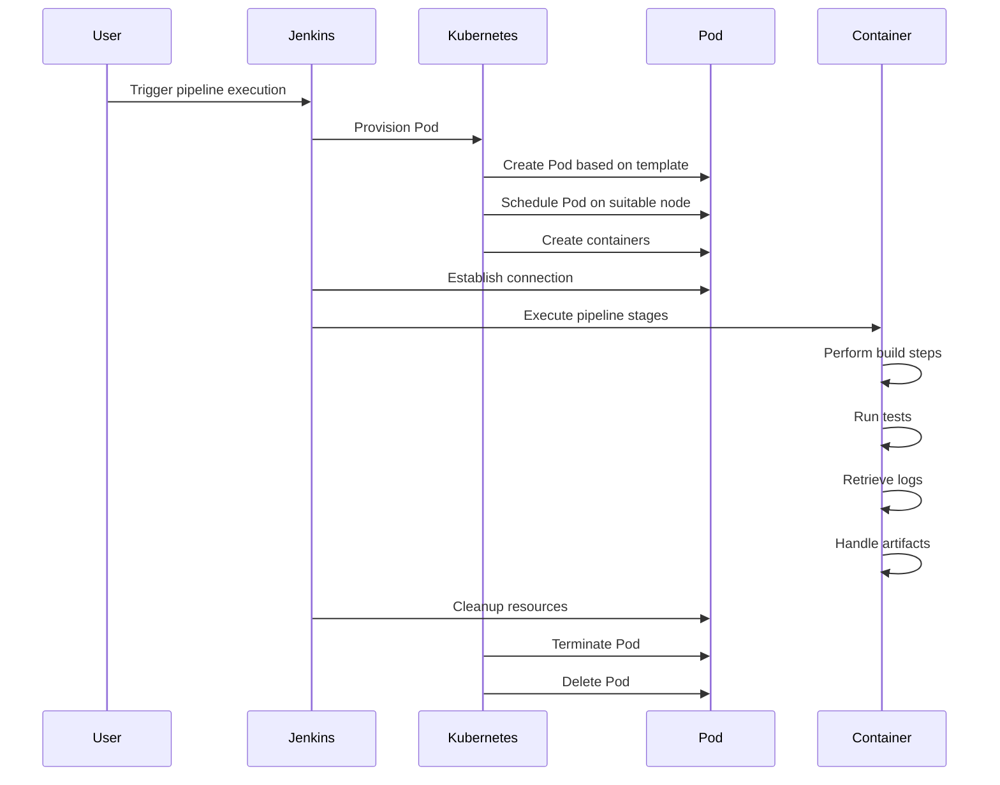

When you run a Jenkins pipeline with the Kubernetes plugin and a Pod template containing multiple containers, the following steps typically occur:

1. **Pipeline Execution Triggered**: The Jenkins pipeline execution is triggered, either manually or through an automated trigger (e.g., webhook, schedule).

2. **Pod Creation**: The Kubernetes plugin provisions a Kubernetes Pod based on the specified Pod template. The Pod template contains the configuration for the Pod, including the container images, environment variables, volumes, and other settings.

3. **Pod Scheduling**: Kubernetes schedules the Pod to run on a suitable node within the cluster. The scheduling process considers various factors, such as resource availability, affinity/anti-affinity rules, and node selectors.

4. **Container Creation**: The Kubernetes runtime creates the containers defined within the Pod template. Each container is instantiated based on its specified image and configuration.

5. **Jenkins Agent Connection**: Jenkins establishes a connection to the Pod and sets up a Jenkins agent within the Pod. The agent serves as the execution environment for running the pipeline stages and steps.

6. **Pipeline Execution**: The Jenkins agent within the Pod starts executing the pipeline stages and steps defined in the Jenkinsfile or pipeline script.

7. **Container Interaction**: Depending on the pipeline stages, the Jenkins agent may interact with the containers within the Pod. This interaction can include executing commands, running tests, performing build steps, and retrieving logs.

8. **Artifact Handling**: The pipeline stages may involve handling artifacts such as JAR files, Docker images, or other build outputs. These artifacts can be stored, published, or deployed as part of the pipeline execution.

9. **Pipeline Completion**: The pipeline stages continue executing until all steps are completed or until an error occurs. The pipeline can include various stages, such as build, test, deploy, and post-build actions.

10. **Pod Cleanup**: After the pipeline execution finishes, the Kubernetes plugin cleans up the Pod and associated resources. This includes terminating the Jenkins agent, deleting the Pod, and freeing up any allocated resources.

Throughout this process, Jenkins manages the coordination and execution of the pipeline steps, while Kubernetes handles the Pod provisioning, scheduling, and container runtime operations. The Jenkins agent within the Pod serves as the execution environment for running the pipeline stages and interacting with the containers.

