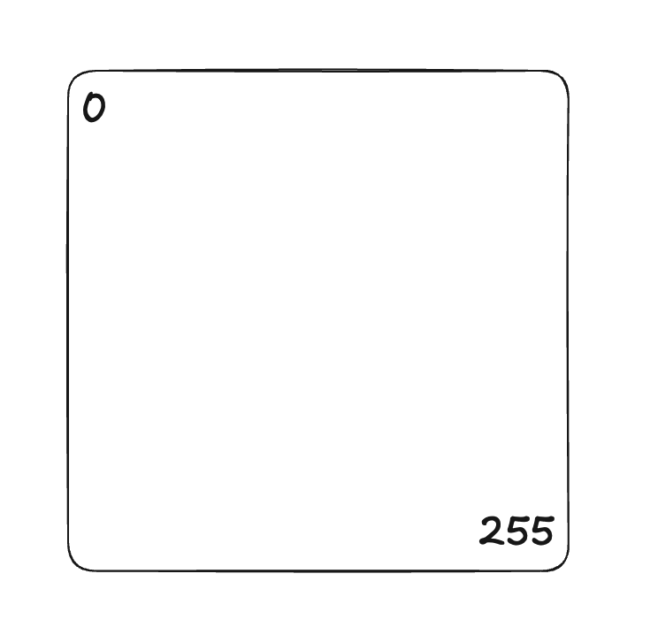
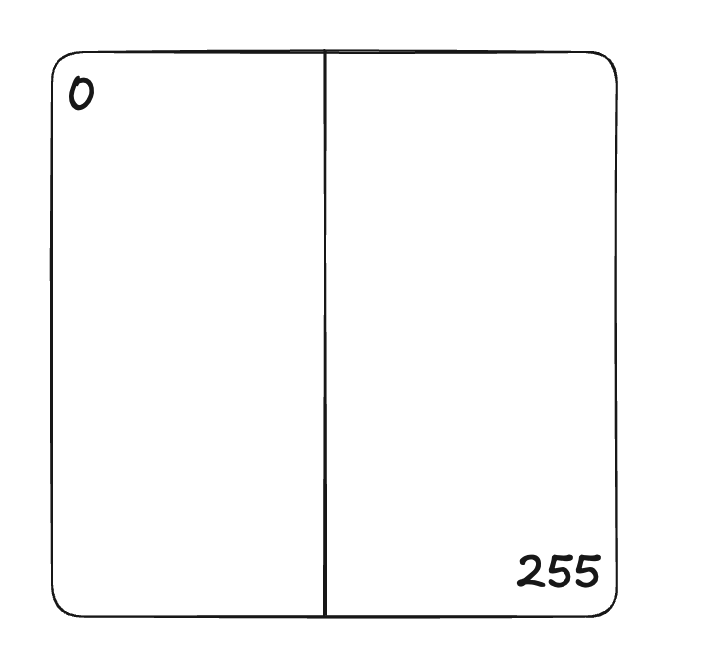
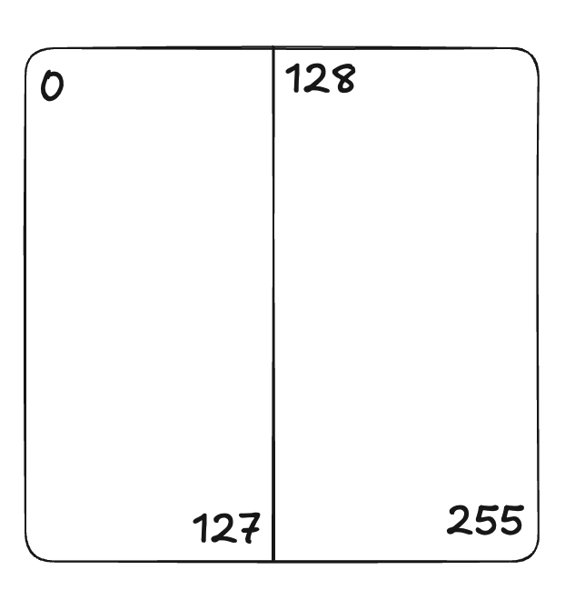

More than 10 years ago, I studied system administration and network security. Today, I’m revisiting my knowledge, which hasn't been in use for a while.

One of the topics I’m revisiting is **network subnetting**. In today’s world, it’s hard to imagine anyone manually calculating networks on a piece of paper. However, I still believe it's a fundamental skill worth practicing from time to time.

In this post, I’ll briefly explain the "box method" I was taught a decade ago to help visualize and understand subnetting.

---

## Why subnetting matters

Before diving into the method, let’s quickly recap why subnetting is important. Subnetting allows network administrators to break a large network into smaller, manageable sub-networks, each with a specific range of IP addresses. This helps in:

* **Optimizing IP address usage**
* **Improving network security**
* **Increasing network efficiency and reducing congestion**

By subnetting a network, we can create multiple networks, manage traffic better, and improve performance.

---

## The box (square) method

The **box method** (also called the square method) is a **visual approach** to subnetting that helps break down and understand IP address spaces. It uses simple visual grids to represent how a large network can be subdivided into smaller subnets.

### Step-by-step guide

#### 1. Draw a box

Let’s say we have a network `192.168.1.0`, which gives us 256 IP addresses in the range:
192.168.1.**0** - 192.168.1.**255**

Place **0** and **255** in the opposite corners of the box.

#### 2. Divide the box in half horizontally

Now, divide the box in half. We need to add new numbers in the corners: **127** and **128**. This gives us two subnets with 128 IP addresses each:

1. 192.168.1.**0** - 192.168.1.**127**
2. 192.168.1.**128** - 192.168.1.**255**

#### 3. Divide the box in half vertically

Next, divide the box vertically.

Divide each box number by 2 each time and add the first and last IP addresses to the corners.

Now, we have 4 subnets, each with 64 IP addresses, in the following ranges:

1. 192.168.1.**0** - 192.168.1.**63**
2. 192.168.1.**64** - 192.168.1.**127**
3. 192.168.1.**128** - 192.168.1.**191**
4. 192.168.1.**192** - 192.168.1.**255**

#### 4. Continue dividing

You can continue dividing the box as much as needed, ensuring that each box contains at least 2 addresses.

### Why use the box method?

By dividing the network visually, you can easily determine the **subnet range**, **broadcast address**, and **usable IPs** for each subnet.

---

### TL;DR: Watch the video

If you'd rather watch this in action, check out the video version of this post on YouTube: [Watch it on YouTube](https://youtu.be/9mB0JBIgNt4?si=K2eH_NHu2nIL0m4J).

---

### Final thoughts

Although manual subnetting may seem outdated in a world of automated network tools, it’s still an important skill. It helps build a deep understanding of how networks work and improves your ability to troubleshoot and configure networks effectively.

So, take a few minutes to practice subnetting using the box method. It might help you in ways beyond just getting IP addresses right.

---

That's it for now!
